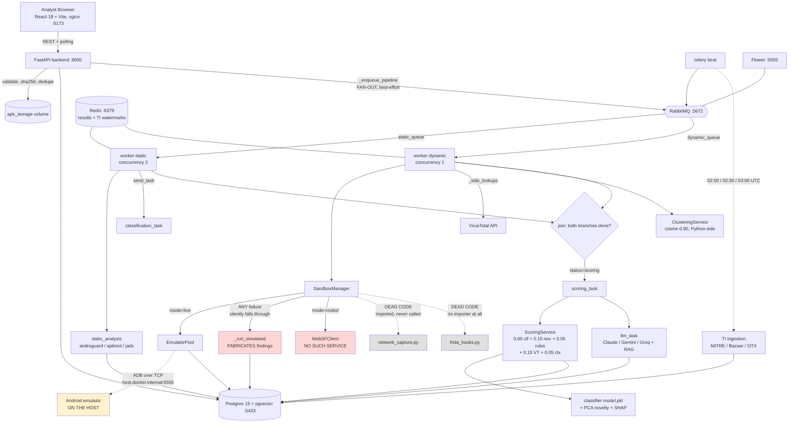
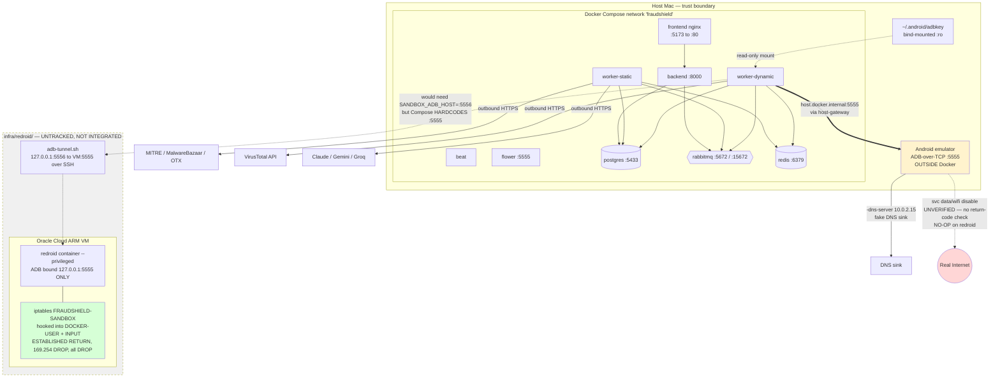

# FraudShield-AI — Current State Audit

**Date:** 2026-08-16
**Commit:** HEAD `604c55c`
**Scope:** read-only inspection of the working tree at `/Users/pulkitverma/Developer/Fraudshield-AI`

Every claim below was verified against source. Where the repository cannot answer a
question, it is marked `UNKNOWN — requires environment verification`. Several claims in
the project's own documentation turned out to be **false**; those are called out
explicitly in §22 and §18.

No modifications were made to the repository during this audit.

---

## 1. Project overview

An Android banking-fraud APK analysis platform. A user uploads an APK; the backend hashes
it, stores it, then runs static analysis and a "dynamic" sandbox stage in parallel,
cross-references VirusTotal and a locally-ingested threat-intel corpus, assigns the sample
to a campaign cluster, produces an ML risk score with SHAP explanations, generates an LLM
narrative report, and surfaces a 0–100 verdict with a severity band and a recommended
action (up to "escalate to CERT-In" — the deployment target is India).

Scale: ~15,091 lines of Python across `backend/app`, 11 API routers, 12 ORM models,
10 services, 7 Celery tasks, 7 Alembic migrations, 158 backend tests, 3 frontend test
files.

---

## 2. Technology stack (versions from the repo only)

From `backend/requirements.txt`: fastapi 0.111.0, SQLAlchemy 2.0.31, alembic 1.13.2,
celery 5.4.0, redis 5.0.7, androguard 3.4.0a1, xgboost 2.0.3, shap 0.45.1, frida 16.4.8,
flower 2.0.1, pytest 8.2.2. `torch==2.3.1` is **commented out**, which matters — see §6.

From `infra/docker-compose.yml` image pins: `pgvector/pgvector:pg15`,
`rabbitmq:3.13-management`, `redis:7-alpine`, `busybox`.

From `frontend/package.json`: React 18.3.1, Vite 5.4, TypeScript 5.5.4, Tailwind 3.4.7,
recharts, @tanstack/react-query, vitest.

Python version: `UNKNOWN — requires environment verification`. `__pycache__` artifacts show
3.10, 3.12, and 3.14 bytecode side by side, so at least three interpreters have run this
tree; the authoritative one is whatever `backend/Dockerfile` pins.

---

## 3. Repository structure

```
backend/app/
  api/v1/       analysis, auth, chat, classification, clusters, dashboard,
                submissions, threat_intelligence, verdicts, virustotal
  core/         config, database, logging, security, types
  dynamic_analysis/  sandbox_manager, emulator_pool, mobsf_client,
                     frida_hooks, network_capture
  llm/          claude_client, gemini_client, groq_client, prompts/, rag/
  middlewares/  error_handler, rate_limiter
  ml/           feature_spec, classifier/{infer,train,train_real,model.pkl},
                novelty/{autoencoder,benign_reference.npy}, explainability/
  models/       12 ORM models
  repositories/ per-aggregate data access
  services/     10 services incl. scoring, clustering, sanitization
  static_analysis/  androguard_wrapper, apktool_wrapper, jadx_wrapper,
                    permission_extractor
  ti_ingestion/ fetchers/, normalizer, validator, deduplicator, upsert,
                fallback_reporter
  workers/      celery_app, tasks/{static,dynamic,scoring,llm,retention,
                                    classification,ti_ingestion}
  tests/        15 test modules
frontend/src/   4 pages, 12 component dirs, 4 hooks, 4 services
infra/          docker-compose.yml, redroid/ (UNTRACKED)
docs/           README.md, threat_intelligence.md
```

Notable: `infra/redroid/` is **untracked** (`git status` → `?? infra/redroid/`). `.env`,
`backend/adb_keys`, `backend/venv`, `csv_folder` have **zero git-tracked files**.
`backend/adb_keys/adbkey` is 18 bytes with no PEM header — a placeholder, not key material.

---

## 4. The APK analysis pipeline as it actually runs

The pipeline is a **fan-out with a race-resolved join**, not a linear chain. Both branches
try to advance to scoring, and whichever finishes second wins.

`POST /api/v1/submissions` (`api/v1/submissions.py:76`) → validate → `sha256_bytes` →
**duplicate-hash short-circuit** (`:93`, returns HTTP 200 with the existing submission and
does *not* re-queue) → `storage.upload_apk` → `repo.create` → `_enqueue_pipeline` (`:47`).

`_enqueue_pipeline` fires two independent tasks. `run_static_analysis.delay(sid)` goes to
`static_queue`. The dynamic task is dispatched **by name** via `send_task(...)` to
`dynamic_queue` so the API never imports sandbox code. Both enqueues are wrapped in bare
`except Exception` and only *log* — an upload succeeds even when the broker is down,
leaving a submission permanently `queued`.

The join logic is symmetric and duplicated. `static_task._try_advance_pipeline` (`:131`)
checks whether dynamic finished; `dynamic_task` (`:96`) checks `_static_finished`. Each
sets status `scoring` and calls `_enqueue_scoring`. `_static_finished`
(`dynamic_task.py:32`) is a bare existence probe:
`SELECT static_findings.id WHERE submission_id = ?`. It tests only that a row exists, not
that static analysis *succeeded*.

Static also fires `_enqueue_classification` → `classification_task.run_app_classification`,
which is off to the side and feeds the `W_CONTEXT` scoring component.

Correcting the assumed diagram: there is **no** `upload → static → dynamic → score`
sequence. Static and dynamic run concurrently on separate queues from the moment of upload.
The only ordering guarantee is a retry loop in `dynamic_task` (`:56-71`) that applies
**in simulate mode only** — it retries up to 3 times waiting for a static row, then
proceeds regardless.

---

## 5. Static analysis

`static_analysis/` wraps three external tools: `androguard_wrapper`, `apktool_wrapper`,
`jadx_wrapper`, plus `permission_extractor`.
`androguard_wrapper.SENSITIVE_API_MARKERS` defines the eight API buckets the ML layer
consumes. Whether apktool and jadx binaries exist in the image is
`UNKNOWN — requires environment verification`.

Output lands in `static_findings` with `package_name`, `permissions` (JSON with a
`declared` list), `api_call_graph` (JSON with a `sensitive_calls` map),
`obfuscation_score`, certificate and component counts.

---

## 6. ML and risk scoring

**Feature contract** — `ml/feature_spec.py`. A fixed, *named* 29-dimensional vector:
10 permission booleans + `declared_perm_count` + `dangerous_perm_count` + 8 sensitive-API
bucket counts + `cert_self_signed`, `obfuscation_score`, `n_activities`, `n_services`,
`n_receivers` + 4 dynamic flags (`dyn_sms_access`, `dyn_accessibility_abuse`,
`dyn_overlay_detected`, `dyn_network_calls`). This is a hand-designed contract, **not**
feature hashing. (The md5→768 hashing in this repo belongs to `llm/rag/embeddings.py` and
serves TTP retrieval, not classification — an easy conflation to make and worth flagging
to whoever plans next.)

**Classifier** — `ml/classifier/infer.py`. Loads `model.pkl` (539,874 bytes, 2026-08-10)
once and caches. On load failure it falls back to `_heuristic_score` (`:56`) and
`model_version()` returns `"heuristic-fallback-v0"`. That string is the only runtime signal
distinguishing a real prediction from a heuristic guess.

**Novelty** — `ml/novelty/autoencoder.py`, reconstruction error from a PCA or torch
autoencoder. `_resolve_backend("auto")` picks PCA when torch is absent, and torch *is*
commented out of requirements, so **PCA is the live path** unless the image installs torch
separately. `benign_reference.npy` (116,360 bytes ≈ 501 × 29 float64) **is present**, so
the real calibration reference loads and the `novelty.reference_synthetic` warning at
`:167` does not fire.

**Ensemble** — `services/scoring_service.py:36-40`:

```
W_CLASSIFIER = 0.60   W_NOVELTY = 0.15   W_RULES = 0.05
W_VT         = 0.15   W_CONTEXT = 0.05            (sums to 1.00)
```

Two behaviours worth designing around. First, an **obfuscation override** (`:82-92`): when
`classifier_score < 0.10` *and* `rule_signal > 0.0` *and* (`obfuscation_score >= 0.5` or
a permission-combo fallback fired), the weights shift — `w_c = W_CLASSIFIER - 0.20`,
`w_r = W_RULES + 0.20`. This deliberately re-weights toward structural evidence when the
classifier is blinded by obfuscation. Second, **missing components resolve to 0.5
(neutral), not 0.0**: `_vt_signal` returns 0.5 for absent, not-found, *and* errored lookups
(`:190-216`), with the explicit comment "A VT outage must never look like a clean verdict."
`_context_signal` by contrast returns **0.0** for `no_classification` (`:168`). The two
components use opposite conventions for "no data," which is a real asymmetry in the design.

**Bands** (`:321-337`): `>=75 critical`, `>=50 high`, `>=25 medium`, else `low`.
Actions: `monitor`, `alert_customers`, `block_hash`, `escalate_cert_in`.

---

## 7. Dynamic analysis — the most important section

**This is where the repository diverges most sharply from its own description.**
`sandbox_manager.py` documents three modes, and the divergence starts with their defaults:

| Reader | Default | Source |
|---|---|---|
| `SandboxManager.__init__` | `"mobsf"` | `sandbox_manager.py:35` |
| `dynamic_task.run_dynamic_analysis` | `"simulate"` | `dynamic_task.py:55` |
| Compose `worker-dynamic` | `"live"` | `docker-compose.yml:143` |

Three different defaults for one variable. Compose wins in deployment, so **live is the
operative mode**, but any code path constructing `SandboxManager()` outside Compose gets
`mobsf`.

**There is no `mobsf` service in `docker-compose.yml`.** Verified:
`grep -n mobsf infra/docker-compose.yml` → no match. Yet `sandbox_manager.py:4` says
"MobSF container must be running (see infra/docker-compose.yml)" and the
unreachable-warning at `:56` instructs the operator to run
`docker compose ... up mobsf`, a command that cannot succeed.

**The silent degradation cascade** (`sandbox_manager.py:47-62`) is the single most
consequential structure in the codebase:

```python
if self.mode == "mobsf":
    if self._mobsf and self._mobsf.is_available:
        try: return self._run_mobsf(...)
        except Exception as exc: log.warning("sandbox.mobsf_failed_simulate", ...)
    else:
        log.warning("mobsf.unreachable", ...)
if self.mode == "live":                      # note: `if`, not `elif`
    try: return self._run_live(...)
    except Exception as exc: log.warning("sandbox.live_failed_simulate", ...)
return self._run_simulated(submission_id, static_hint or {})
```

Any failure in live mode — emulator unreachable, ADB unauthorized, install rejected — is
caught, downgraded to a `log.warning`, and falls through to `_run_simulated`. The
submission then completes **successfully** with fabricated findings.

And `_run_simulated` (`:185-215`) does fabricate. It derives `sms_access`,
`accessibility_abuse`, `overlay_detected` from static permissions, then **invents network
destinations**:

```python
network_calls = [
    {"host": "c2-sink.local",   "port": 443, "protocol": "tcp", "sink": True},
    {"host": "otp-collect.sink", "port": 80,  "protocol": "tcp", "sink": True},
]
```

**The `mode` field is never persisted.** `DynamicAnalysisService._persist`
(`dynamic_analysis_service.py:85-101`) writes `sms_access`, `accessibility_abuse`,
`overlay_detected`, `network_calls`, `sandbox_log_path` — and stops.
`models/dynamic_finding.py` has **no `mode` column**. `mode` survives only in a log line
and inside the JSON blob at `sandbox_log_path`. Consequence: **given a row in
`dynamic_findings`, it is impossible via the database to tell whether the sample was
actually executed or the findings were synthesised from its manifest.** Those synthesised
rows feed `dyn_*` features into the classifier and `dyn_flags` into `_rule_signal`.

**The live path uses logcat only.** `_run_live` (`:98-174`) does:
`adb install --bypass-low-target-sdk-block -r -d -t` → `logcat -c` →
`monkey -p <pkg> -c LAUNCHER 1` → `sleep RUN_SECONDS` (default 60) → capture
`logcat -v brief` → `_parse_logcat` → `force-stop`, `uninstall`, `pool.release`.
Behaviour detection is six regexes over log text (`_PATTERNS`, `:232-246`) matching strings
like `SmsManager`, `AccessibilityService`, `DexClassLoader`. This detects *log messages
that mention* an API, not invocation of it — a benign app logging `"OkHttp"` trips
`c2_connect`, and any malware that simply doesn't log is invisible.

---

## 8. Android emulator architecture

`dynamic_analysis/emulator_pool.py`, 222 lines. Two modes: LOCAL launches the `emulator`
binary; REMOTE (`SANDBOX_ADB_HOST` set) `adb connect`s to an already-running device.
`EmulatorInstance` carries `serial`, `avd_name`, `console_port`, `remote`. Pool is a
`queue.Queue` with a lock, `POOL_SIZE` default 1.

Local boot (`_boot_one`, `:134`) passes `-no-window -no-audio -no-boot-anim -wipe-data
-dns-server 10.0.2.15 -no-snapshot-save`. The fake DNS server is the local containment
mechanism.

Boot polling (`_wait_for_boot`, `:155`) is good: `BOOT_TIMEOUT` 180s local,
`REMOTE_BOOT_TIMEOUT` 90s remote, with explicit `unauthorized` detection that raises an
actionable `RuntimeError` rather than burning the whole timeout.

Two problems.

`_harden_network` (`:189-196`) runs `svc data disable` and `svc wifi disable`, then
unconditionally logs `emulator.network_hardened`. It **never checks the return code and
never verifies egress**. On redroid there is no emulated radio, so both commands are silent
no-ops — and the log line asserts the network is hardened when it is not.

`release` (`:204-211`) guards the reset: `if not inst.remote:` … `pm clear-all`.
**Remote devices are never reset between samples.** With local AVDs `-wipe-data` covers
this; with a persistent remote device (redroid bind-mounts `/data`) samples accumulate
state and cross-contaminate. `shutdown` (`:213`) similarly only `emu kill`s non-remote
instances, which is correct.

---

## 9. ADB architecture

`ADB_BIN` from env, default `adb`. Serial is `emulator-<port>` locally or the `host:port`
string remotely. `is_available()` (`:52`) requires only the `adb` binary in remote mode;
local mode also requires `emulator`.

Compose wires the worker to the host emulator at `docker-compose.yml:144-163`:
`SANDBOX_ADB_HOST: "host.docker.internal:5555"` (**hardcoded, not parameterized**),
`ADB_BIN: adb`, `extra_hosts: ["host.docker.internal:host-gateway"]`, and two read-only
mounts of `~/.android/adbkey` / `adbkey.pub` into `/home/appuser/.android/`. The comment at
`:158-159` is accurate: the key is host-mounted, never baked into the image.

There is a caution here. `_connect_remote` (`:97-106`) handles `failed to authenticate`
with a helpful hint about the "Allow USB debugging?" prompt. That prompt implies a
**user-interactive trust step on a device that runs live malware** — the trust model
assumes a human operator at the emulator.

---

## 10. Current network architecture

**There is no network monitoring in the live path.** Verified by grep across `backend/app`:

- `frida_hooks.py` has **zero importers**. Nothing anywhere in `backend/app` references
  `frida`, `frida_hooks`, or `FridaHook` outside the file itself. Frida 16.4.8 is a
  declared dependency that is never invoked. The module is dead code.
- `network_capture.py` is imported **once** — `sandbox_manager.py:23`,
  `from app.dynamic_analysis import emulator_pool, network_capture` — and the name
  `network_capture` never appears again in that file or any other. No tcpdump ever runs.
  The module is dead code reachable only by an unused import.

So every value in `dynamic_findings.network_calls` comes from one of three places:
regex-scraping hostname-shaped substrings out of logcat text (`_NETWORK_RE`, `:248`,
applied only to lines matching the `c2_connect` pattern, excluding `*.android.com`); the
two hardcoded `.local`/`.sink` entries in simulate mode; or the single hardcoded
`c2-sink.mobsf` entry in mobsf mode. **No packet is ever observed.**

Containment, in the local-AVD architecture that is currently wired: the emulator
`-dns-server 10.0.2.15` sink, plus `svc data/wifi disable` (unverified, no return-code
check). That is the whole boundary.

**The redroid/Oracle work is not integrated.** `infra/redroid/setup-oracle-host.sh` and
`adb-tunnel.sh` exist on disk and are untracked. They implement genuine host-level
containment: a dedicated bridge network `fraudshield-sandbox` (172.31.240.0/24), an iptables
chain `FRAUDSHIELD-SANDBOX` hooked into **both** `DOCKER-USER` (forwarded traffic) and
`INPUT` (host-local traffic, which `DOCKER-USER` never sees), `ESTABLISHED,RELATED → RETURN`
first so ADB survives, `169.254.0.0/16 → DROP` for cloud metadata, then a blanket `DROP`;
ADB published to `127.0.0.1:5555` only; and four containment probes (ICMP, DNS/udp,
TCP/443, metadata) that must all fail or the script aborts.

But the Python side that would consume it **was never written**. `git diff HEAD` is empty
for both `infra/docker-compose.yml` and `backend/app/dynamic_analysis/emulator_pool.py`.
Concretely:

- `SANDBOX_EGRESS_BLOCKED_EXTERNALLY` is read by **no application code**. Its only
  occurrence in the entire repo is `infra/redroid/adb-tunnel.sh:117`, where the script
  *prints it as advice*. Setting it in `.env` has no effect whatsoever.
- `SANDBOX_ADB_HOST` is hardcoded in Compose, so retargeting the worker to the tunnel's
  port 5556 requires editing `docker-compose.yml`, not `.env`.
- Nothing refuses to detonate on an uncontained device. There is no egress assertion
  anywhere in the Python.

---

## 11. Docker and infrastructure

Ten services in `infra/docker-compose.yml`: `postgres` (pgvector/pg15, host **5433**→5432),
`rabbitmq` (5672 + 15672 management), `redis` (6379), `storage-init` (busybox one-shot that
chowns the shared volume to 1000:1000), `backend` (alembic upgrade head then uvicorn, 8000),
`worker-static` (`-Q static_queue --concurrency=2`), `worker-dynamic`
(`-Q dynamic_queue --concurrency=1`), `beat`, `flower` (5555), `frontend` (nginx, 5173→80).
Volumes: `pgdata`, `apk_storage`.

Well-handled details: workers and beat set `healthcheck: disable: true` because the image's
baked HTTP probe would mark a Celery worker permanently unhealthy; Flower gets its own
probe on 5555; `depends_on` uses `service_healthy` / `service_completed_successfully`
conditions; `worker-dynamic` re-declares `apk_storage` because YAML merge keys don't
concatenate sequences, with a comment saying exactly that.

The `x-backend-env` block carries a long, well-earned warning (`:8-20`) that anything listed
there **overrides** `.env`, and that `FOO: ${FOO:-}` resolves from the *shell* rather than
`.env` — "That is exactly how VIRUSTOTAL_API_KEY became ''." TI secrets are deliberately
omitted so `env_file` supplies them.

Two hardcoded credentials sit in that block: `JWT_SECRET: 37368421e70e...` (`:27`) and
Postgres `fraudshield:fraudshield` (`:24`, `:56-57`).

Port collision worth noting for the redroid plan: **Flower publishes 5555**, the same port
ADB conventionally uses. `adb-tunnel.sh` already accounts for this by defaulting
`LOCAL_PORT=5556` with the comment "NOT 5555 — Flower already publishes that."

---

## 12. Host security boundaries

**Confirmed:**

- `worker-dynamic` reaches the host emulator through `host.docker.internal:5555` with
  `host-gateway`. ADB-over-TCP to the host is an intended, configured path.
- The host ADB private key is bind-mounted read-only into the worker (`:160-161`); it is
  not baked into the image by Compose.
- APK bytes live on a shared named volume `apk_storage` mounted into backend, both workers,
  beat, and flower.
- The sample executes on the **host's** emulator, outside Docker isolation. The container
  boundary protects the worker, not the host.
- `infra/redroid/setup-oracle-host.sh` runs redroid `--privileged` — appropriate for
  binder, and a full host-compromise path if the guest escapes.

**Likely:**

- With `-dns-server 10.0.2.15` and `svc data/wifi disable` unverified, a live sample on the
  host AVD probably retains some egress. "Likely" rather than "confirmed" because AVD
  `-dns-server` behaviour depends on the emulator build and cannot be settled from the repo.
- `backend/Dockerfile` reportedly bakes `adb_keys` into the image. The tracked files are
  18-byte placeholders, so nothing sensitive is baked *today*, but the mechanism would
  capture a real key if one were placed there.

**Unknown — requires environment verification:**

- Whether the host AVD actually has egress (needs a live probe).
- Whether apktool/jadx/frida binaries exist in the built image.
- Whether `~/.android/adbkey` on the host is the previously-compromised key or a
  regenerated one.
- Whether Docker Desktop's `host.docker.internal` is reachable from any other process on
  the host.

---

## 13. Dynamic behaviour collection

Three booleans and a JSON list, and nothing else: `sms_access`, `accessibility_abuse`,
`overlay_detected`, `network_calls`. No syscall tracing, no file-system monitoring, no API
hooking, no screenshots, no process tree. `dynamic_task.py:86` sets a UI stage detail
reading `"capturing syscalls"` — **no syscall capture exists anywhere in the codebase.**
That string is user-visible and inaccurate.

Collection is one 60-second `monkey`-driven launch (`RUN_SECONDS`, `SANDBOX_RUN_SECONDS`),
single event, no interaction beyond the launcher intent — so anything gated behind a login,
a delay, or a C2 command is out of reach by construction.

---

## 14. Current network monitoring

Covered in §10 and it bears restating plainly, because it is the crux for architectural
planning: **there is none.** `network_capture.py` exists, is imported, and is never called.
`frida_hooks.py` exists and is never imported. Every `network_calls` entry is either a
hostname-shaped regex match against log *text* or a hardcoded fake.

---

## 15. Threat intelligence

Two distinct things share the name, which is worth untangling.

**Ingestion** (`ti_ingestion/`) pulls into a local corpus: `fetchers/` for MITRE ATT&CK
Mobile, MalwareBazaar, and AlienVault OTX, through `normalizer` → `validator` →
`deduplicator` → `upsert`, with a `fallback_reporter` for surfacing fetch failures.
Scheduled in `celery_app.beat_schedule` at 02:00, 02:30, and 03:00 UTC daily, all pinned to
`static_queue`. `normalizer.py:71` derives a stable external ID as
`sha256(f"{source}:{external_id}")[:12].upper()`. Watermarks live in Redis under
`ti:last_fetch:<source>`.

**Per-submission TI** is only VirusTotal. In `dynamic_task._side_lookups` (`:122-147`), the
stage the UI labels "Threat Intelligence" wraps exactly one call —
`VirustotalService(db).lookup(submission_id)`. The ingested MITRE/Bazaar/OTX corpus is
**not** consulted during scoring. It feeds `llm/rag/knowledge_base.py`, which embeds active
TTPs into a 768-dim matrix via the md5 hashing embedder in `llm/rag/embeddings.py` for
report generation.

Note that `_side_lookups` marks the TI stage `failed` on VT exceptions but the clustering
block below it (`:141-147`) logs at `debug` and records no stage at all — a clustering
failure is invisible.

One carried-over data issue: the OTX Redis watermark was advanced by failed fetches before
that bug was fixed, so `ti:last_fetch:otx` may point past un-ingested data.

---

## 16. Database

Postgres 15 with pgvector. Twelve models: `submission`, `user`, `static_finding`,
`dynamic_finding`, `ml_score`, `verdict`, `cluster`, `llm_report`, `virustotal_lookup`,
`threat_intelligence`, `app_classification`, `audit_log`.

Migrations are a **clean linear chain, single head**:
`0001 → 0002 → 0003 → 0004 → 0005 → 0006 → fc3b3e1b0973`
(`0006_app_classification`, then `fc3b3e1b0973_add_analysis_stages_to_apk_submissions`).
The earlier dual-head problem is resolved.

`clusters.family_signature` is `Vector768`, a portable type that falls back to JSON off
Postgres (`test_clustering.py:6` relies on this). Importantly, pgvector here is **typed
storage only** — similarity is computed in Python (`clustering_service.py:9` says so
explicitly, `_cosine` at `:133`, `SIMILARITY_THRESHOLD = 0.90` at `:32`). No vector index,
no ANN query. Cluster assignment scans candidate centroids in application code.

`submissions.status` is constrained both in the ORM (`CheckConstraint`,
`submission.py:32-38`) and as a `String(20)`. `analysis_stages` is
`JSON().with_variant(JSONB(), "postgresql")`.

Known dead code: a duplicate `update_analysis_stage` definition at
`submission_repository.py:165` shadows an earlier one.

---

## 17. Celery and async architecture

Broker RabbitMQ, result backend Redis, JSON-only serialization, UTC. Two queues,
`static_queue` (default) and `dynamic_queue`, with explicit `task_routes` per module —
including `ti_ingestion_task.*` pinned to `static_queue` so ad-hoc `send_task` calls land
where beat expects.

Reliability config (`celery_app.py:51-65`): `task_acks_late=True`,
`task_reject_on_worker_lost=True`, `worker_prefetch_multiplier=1`, `task_time_limit=900` /
`task_soft_time_limit=840`.

A subtlety the next agent should know: `task_annotations` uses a `"*"` glob setting
`max_retries: 3`. `run_dynamic_analysis` declares `max_retries=6` in its decorator
(`dynamic_task.py:46`) specifically to accommodate 3 waits-for-static plus 3 real failures.
**Whether the glob annotation overrides the decorator is a Celery-version-specific
precedence question that cannot be settled from the repo** —
`UNKNOWN — requires environment verification`. If the annotation wins, the intended 6
retries are silently 3.

Beat has six entries: daily APK purge (03:00), hourly cluster-centroid recompute,
stuck-submission recovery every 5 minutes, and the three TI fetches. Note
`purge-expired-apks-daily` and `ingest-otx-daily` are both at 03:00 on the same queue.

Nearly every cross-task handoff is `send_task` by name inside `try/except` that logs at
`debug` and continues. This decouples the modules cleanly but means a broken handoff is
close to silent.

---

## 18. Current security and correctness issues

**S1 — Simulated findings are indistinguishable from real execution.**
*Severity: Critical.* Location: `sandbox_manager.py:47-62`,
`dynamic_analysis_service.py:85-101`, `models/dynamic_finding.py`. Evidence: `run()` falls
through to `_run_simulated` on any live/mobsf failure; `_persist` writes five fields and not
`mode`; the model has no `mode` column. Why it matters: an analyst reading a verdict cannot
know whether the sample ran. Fabricated `dyn_*` flags and invented `c2-sink.local` /
`otp-collect.sink` hosts flow into the classifier and rule signal, and the submission is
marked `completed`. This directly violates the project's own rule that missing data be
distinguishable from negative results.

**S2 — `_harden_network` reports success without verifying anything.**
*Severity: Critical.* Location: `emulator_pool.py:189-196`. Evidence: two `subprocess.run`
calls whose return codes are never inspected, followed by an unconditional
`log.info("emulator.network_hardened")`. On redroid, which has no radio, both are no-ops.
Why it matters: the log asserts containment that does not exist, and live malware may reach
real C2 infrastructure. Nothing anywhere refuses to detonate on an unverified device.

**S3 — No network monitoring despite the dependency and the modules.**
*Severity: High.* Location: `frida_hooks.py` (no importers), `network_capture.py` (imported
at `sandbox_manager.py:23`, never called). Evidence: repo-wide grep for `frida` outside its
own file returns nothing; `network_capture` appears exactly once. Why it matters: the
platform's stated purpose is observing fraud behaviour, and its two behavioural-observation
modules are unreachable. `network_calls` is regex-over-logtext or hardcoded.

**S4 — Remote devices are never reset between samples.**
*Severity: High.* Location: `emulator_pool.py:204-211`. Evidence: `if not inst.remote:`
guards `pm clear-all`. Why it matters: on any persistent remote device — which is exactly
what the redroid plan introduces, with `/data` bind-mounted — sample *N*'s installed
packages and state persist into sample *N+1*, cross-contaminating findings.

**S5 — Hardcoded JWT secret and database credentials in Compose.**
*Severity: High.* Location: `docker-compose.yml:27` (`JWT_SECRET: 37368421e70e...`), `:24`,
`:56-57` (`fraudshield:fraudshield`). Evidence: literal values in a tracked file. Why it
matters: the JWT signing key is in version control; anyone with repo read access can mint
valid tokens against any deployment using this file.

**S6 — `SANDBOX_EGRESS_BLOCKED_EXTERNALLY` is documented but unimplemented.**
*Severity: High.* Location: `infra/redroid/adb-tunnel.sh:117` is its only occurrence in the
repo. Evidence: repo-wide grep finds no reader in `backend/app`. Why it matters: the
deployment instructions the script prints tell the operator to set a flag that does nothing,
creating false confidence that the worker is aware of external containment. Combined with
S2, an operator can believe containment is verified twice over when it is verified nowhere.

**S7 — Instructions reference a service that doesn't exist.**
*Severity: Medium.* Location: `sandbox_manager.py:4` and `:56`; `docker-compose.yml` has no
`mobsf` service. Evidence: `grep -n mobsf infra/docker-compose.yml` → no match. Why it
matters: `mobsf` is `SandboxManager`'s *default* mode, so any non-Compose caller defaults to
an unreachable backend and silently degrades to simulation via S1.

**S8 — Pipeline join tests existence, not success.**
*Severity: Medium.* Location: `dynamic_task.py:32-39`, `static_task.py:131`. Evidence:
`_static_finished` selects `StaticFinding.id` and returns `row is not None`. Why it matters:
a static row written before a partial failure still satisfies the join, so scoring proceeds
on incomplete input.

**S9 — Upload succeeds when the broker is down.**
*Severity: Medium.* Location: `submissions.py:47-71`. Evidence: both enqueues wrapped in
`except Exception`, logging at `warning` and `debug`. Why it matters: the API returns 201 and
the submission sits at `queued` forever. The 5-minute `recover_stuck_submissions` beat job is
the only mitigation.

**S10 — `SANDBOX_MODE` has three conflicting defaults.**
*Severity: Medium.* Location: `sandbox_manager.py:35` (`mobsf`), `dynamic_task.py:55`
(`simulate`), `docker-compose.yml:143` (`live`). Why it matters: behaviour depends on which
entry point constructs the manager, and the simulate-mode wait-for-static logic in
`dynamic_task` is dead under the Compose default.

**S11 — User-facing stage text claims capability that doesn't exist.**
*Severity: Low.* Location: `dynamic_task.py:86`, `"capturing syscalls"`. Why it matters: it
misrepresents rigour to the analyst.

**S12 — Clustering failures are invisible.**
*Severity: Low.* Location: `dynamic_task.py:141-147`. Evidence: `except` logs at `debug` and
records no analysis stage, unlike the VT block above it which marks `failed`.

**S13 — Placeholder `VIRUSTOTAL_API_KEY`.**
*Severity: Low.* A 24-char placeholder in `.env` now actively fails since Compose resolves
it. `_vt_signal` returns 0.5 neutral on error, so the effect is a silently degraded 15%
weight rather than a visible failure.

**S14 — `infra/redroid/` is untracked.**
*Severity: Low.* Two security-critical scripts exist only in the working tree — one
`git clean` from gone, and invisible to teammates and review.

> **Retracted alarm, recorded for completeness:** an earlier pass flagged `CLAUDE_API_KEY`
> and `VIRUSTOTAL_API_KEY` as committed secrets. That was wrong — they were inline comments
> mis-parsed by the audit tooling. Nothing leaked; nothing needs rotating on that account.
> The JWT secret in S5, however, is real.

---

## 19. Analysis lifecycle

Actual status values, from `models/submission.py:20-27` and mirrored in a DB
`CheckConstraint`: `queued`, `static_running`, `dynamic_running`, `scoring`, `completed`,
`failed`.

The docstring says "the status column moves strictly forward through these," but the fan-out
makes that untrue in practice: static and dynamic both write status concurrently, so
`static_running` and `dynamic_running` overwrite each other non-deterministically depending
on which worker commits last. `Submission.progress_pct` (`:90-101`) derives a percentage
from an `order` map, so displayed progress can move backwards.

Separately, `analysis_stages` (JSON) tracks named stages — "Static Analysis",
"Dynamic Analysis", "Threat Intelligence" — each with `running`/`completed`/`failed` and an
optional `error_message`. This is the richer, more truthful record; the scalar `status` is
the lossy one. `failed` is terminal and set only after `MaxRetriesExceededError`.

---

## 20. Frontend

React 18.3.1 + Vite 5.4 + TypeScript 5.5.4 + Tailwind 3.4.7, served by nginx in the
`frontend` service (5173→80), `VITE_API_BASE_URL` injected as a build arg — so the API URL
is baked at image build, not runtime.

Four pages: `LoginPage`, `DashboardPage`, `SubmissionDetailPage`, `ClustersPage`. Twelve
component groups, notably `AnalysisTimeline`, `AnalysisCompletenessCard`, `ClusterExplorer`,
`RiskHeatmap`, `CausalChainSankey`, `ReportViewer`, `ChatPanel`, `InvestigationPanel`,
`TIPipelinePanel`, `QueueTable`, `StatsPanel`. Four hooks: `useAuth`, `usePolling`,
`useSubmissions`, `usePipelineFallbacks`. State via `@tanstack/react-query` plus an
`AuthContext`.

Updates are **poll-based** (`usePolling`, against the lightweight `/status` endpoint); there
is no WebSocket. The existence of `usePipelineFallbacks` and `AnalysisCompletenessCard`
suggests the UI already tries to communicate degraded/incomplete analysis — which is the
natural place to surface a persisted sandbox `mode` if S1 is addressed.

---

## 21. Test coverage

158 backend test functions across 15 modules, and `conftest.py` isolates tests from live
Redis. Coverage is heavily concentrated on threat intel — `test_ti_bazaar_otx`,
`test_ti_deduplicator`, `test_ti_normalizer`, `test_ti_pipeline_integration`,
`test_ti_validator`, `test_threat_intelligence` — six of fifteen modules. Also present:
`test_submissions`, `test_clustering`, `test_analysis_stages`, `test_app_classification`,
`test_dynamic_cluster_exposure`, `test_sanitization`, `test_virustotal_service`.

**There is no test for `sandbox_manager`, `emulator_pool`, `scoring_service`, or
`dynamic_analysis_service`.** The live→simulate fallback, the `mode`-not-persisted gap, the
remote-reset guard, and the entire scoring ensemble including the obfuscation override are
all untested. That distribution explains the finding pattern: the well-tested subsystem (TI)
is the sound one.

Frontend: 3 vitest files — `QueueTable.test.tsx`, `ReportViewer.test.tsx`,
`AnalysisCompleteness.test.tsx`.

Current pass/fail state is `UNKNOWN — requires environment verification`; the suite was not
executed (read-only audit).

---

## 22. Documentation vs. implementation

Documentation is materially ahead of the code in several places. The specific divergences:

`sandbox_manager.py:4` says the MobSF container is in `infra/docker-compose.yml`. **It is
not.** The remediation hint at `:56` prints a command that cannot work.

The module docstring at `emulator_pool.py:12-13` says "network egress is hardened immediately
after connection (wifi+data disabled) so the sample cannot reach real C2 servers." The
mechanism is unverified no-ops on redroid — the claim is not supported.

`dynamic_task.py:86` tells the user it is "capturing syscalls." Nothing does.

`adb-tunnel.sh:114-121` instructs the operator to set
`SANDBOX_EGRESS_BLOCKED_EXTERNALLY=true`, which no code reads, and to change
`SANDBOX_ADB_HOST` in `.env`, which Compose overrides with a hardcoded value.

`docs/README.md` and `docs/threat_intelligence.md` exist; `fraudshield_architecture.html`
sits at the repo root. Their contents were not diffed line-by-line against the code —
`UNKNOWN`, and given the pattern above any capability claim in them should be treated as
unverified until checked.

Worth noting the counter-examples, because they're informative about where the codebase is
trustworthy: the Compose `x-backend-env` warning about shell-vs-`.env` resolution, the
YAML-merge-key comment on `worker-dynamic.volumes`, the healthcheck-disable rationale, and
the `_vt_signal` neutral-default comment are all precise and correct. Documentation quality
tracks test coverage almost exactly.

---

## 23. Current architecture diagram



---

## 24. Current network diagram



Two things this diagram is meant to make unmissable. The sample executes **outside** Docker,
on the host, so the container boundary protects the worker rather than the host. And the only
real containment engineering in the repo sits in the dashed box — written, unintegrated, and
untracked.

---

## 25. Component / file / function reference

| Component | File | Key function | Purpose |
|---|---|---|---|
| Upload API | `api/v1/submissions.py` | `create_submission` `:76` | Validate, hash, dedupe, store, enqueue |
| Pipeline dispatch | `api/v1/submissions.py` | `_enqueue_pipeline` `:47` | Fan-out to static + dynamic queues, best-effort |
| Static task | `workers/tasks/static_task.py` | `_try_advance_pipeline` `:131` | Run static analysis, half of the join |
| Dynamic task | `workers/tasks/dynamic_task.py` | `run_dynamic_analysis` `:49` | Sandbox run, other half of the join |
| Join probe | `workers/tasks/dynamic_task.py` | `_static_finished` `:32` | Existence-only check for static row |
| Sandbox router | `dynamic_analysis/sandbox_manager.py` | `run` `:44` | Mode selection + silent degradation cascade |
| Live sandbox | `dynamic_analysis/sandbox_manager.py` | `_run_live` `:98` | install → monkey → logcat → uninstall |
| Fabrication path | `dynamic_analysis/sandbox_manager.py` | `_run_simulated` `:185` | Derives findings from static, invents hosts |
| Logcat parser | `dynamic_analysis/sandbox_manager.py` | `_parse_logcat` `:254` | 6 regexes over log text → 3 booleans |
| Emulator pool | `dynamic_analysis/emulator_pool.py` | `acquire` / `release` `:204` | Lease devices; remote never reset |
| Egress control | `dynamic_analysis/emulator_pool.py` | `_harden_network` `:189` | Unverified `svc` calls, unconditional success log |
| Dead: packet capture | `dynamic_analysis/network_capture.py` | — | Imported once, never called |
| Dead: instrumentation | `dynamic_analysis/frida_hooks.py` | — | Zero importers repo-wide |
| Persistence gap | `services/dynamic_analysis_service.py` | `_persist` `:85` | Writes 5 fields, drops `mode` |
| Scoring ensemble | `services/scoring_service.py` | `score` `:47` | 5-component weighted 0–100 verdict |
| Obfuscation override | `services/scoring_service.py` | `score` `:81-100` | Shifts 20pp classifier → rules |
| VT signal | `services/scoring_service.py` | `_vt_signal` `:190` | Neutral 0.5 on absent/error |
| Context signal | `services/scoring_service.py` | `_context_signal` `:147` | 0.0 on no classification (asymmetric) |
| Feature contract | `ml/feature_spec.py` | `featurize` | Fixed named 29-dim vector |
| Classifier | `ml/classifier/infer.py` | `predict` / `model_version` | `model.pkl` + heuristic fallback |
| Novelty | `ml/novelty/autoencoder.py` | `novelty_score` | PCA (torch commented out) |
| Clustering | `services/clustering_service.py` | `assign` / `_cosine` `:133` | Greedy nearest centroid, cosine 0.90 |
| TI ingestion | `ti_ingestion/normalizer.py` | `:71` | Stable external ID via sha256 prefix |
| Celery config | `workers/celery_app.py` | `:51-65` | acks_late, 2 queues, `"*"` retry glob |
| Lifecycle | `models/submission.py` | `progress_pct` `:90` | Status order map, can regress |
| Containment (planned) | `infra/redroid/setup-oracle-host.sh` | — | iptables DOCKER-USER + INPUT, probes |
| Tunnel (planned) | `infra/redroid/adb-tunnel.sh` | `:117` | Only mention of the egress flag |

---

## 26. Unknowns — environment information required

Determinable only by inspecting a running deployment or asking the operator:

1. **Python version** in the built backend image. Three bytecode generations (3.10, 3.12,
   3.14) coexist in `__pycache__`; `backend/Dockerfile` is authoritative and was not read in
   full.
2. **Whether `apktool`, `jadx`, and `frida` binaries exist in the image.** The Python
   wrappers assume them; presence determines whether static analysis silently degrades.
3. **Whether `torch` is installed.** Commented out of `requirements.txt`, which forces
   novelty detection onto the PCA backend. If the image installs it separately, the active
   novelty path differs.
4. **Whether the host AVD actually has egress.** Needs a live probe from inside the running
   emulator. The repo cannot settle whether `-dns-server 10.0.2.15` plus the unverified `svc`
   calls achieve containment.
5. **Whether `~/.android/adbkey` on the host is the previously-compromised key or a
   regenerated one.** The tracked `backend/adb_keys/*` files are 18-byte placeholders and
   reveal nothing about the real host key.
6. **Celery precedence: does `task_annotations["*"]["max_retries"] = 3` override the
   `max_retries=6` decorator on `run_dynamic_analysis`?** Version-specific. Determines whether
   the intended 3-waits-plus-3-failures budget exists.
7. **Current test suite pass/fail state.** Not executed, per the read-only constraint.
8. **Actual `.env` contents** — which of `GROQ_API_KEY`, `GEMINI_API_KEY`, `CLAUDE_API_KEY`,
   `VIRUSTOTAL_API_KEY`, `OTX_API_KEY`, `MALWAREBAZAAR_ENABLED` are populated. This determines
   which LLM client and which TI fetchers are live, and whether the 15% VT weight is
   contributing signal or sitting at neutral 0.5.
9. **Whether `ti:last_fetch:otx` in Redis is still poisoned** past un-ingested data by the
   fixed watermark bug.
10. **Whether any submission in the current database was scored on simulated findings.**
    Because `mode` is not persisted, this is *unanswerable from the database* — it would
    require correlating each `dynamic_findings.sandbox_log_path` blob, which is the clearest
    possible demonstration of why S1 matters.
11. **`model.pkl` provenance** — which script produced it (`train.py` synthetic vs.
    `train_real.py`), on what corpus, and its `model_version` string. The artifact is dated
    2026-08-10 and the repo does not record its lineage.
12. **Deployment target for redroid** — whether the Oracle instance exists yet, since
    `infra/redroid/` is untracked and unexecuted.

---

## Closing notes for architectural planning

The highest-leverage observation is that **S1, S2, S4, and S6 compose into a single failure
mode**: analysis can silently become fiction, the system will report success, containment can
be simultaneously unverified and believed-verified, and the database retains no evidence
either way. They are four symptoms of one missing concept — a persisted, trustworthy record
of *how* a sample was analysed and whether the sandbox was provably contained.

Second, the codebase's quality is strongly bimodal, and the split tracks test coverage
precisely: the TI ingestion pipeline is careful, well-tested, and accurately documented, while
the dynamic-analysis path has no tests and documentation that overstates it. That asymmetry is
probably the most useful signal about where to direct effort.

No modifications were made to the repository during this audit.
